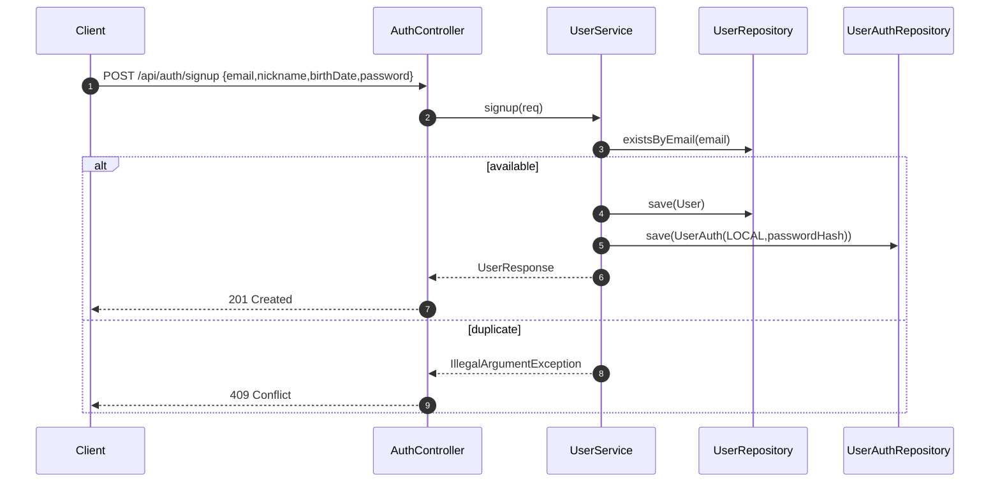
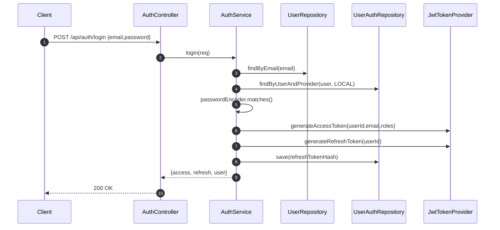
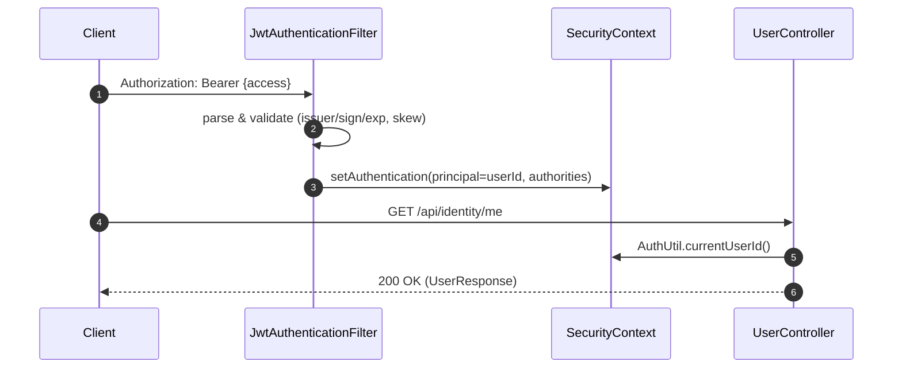
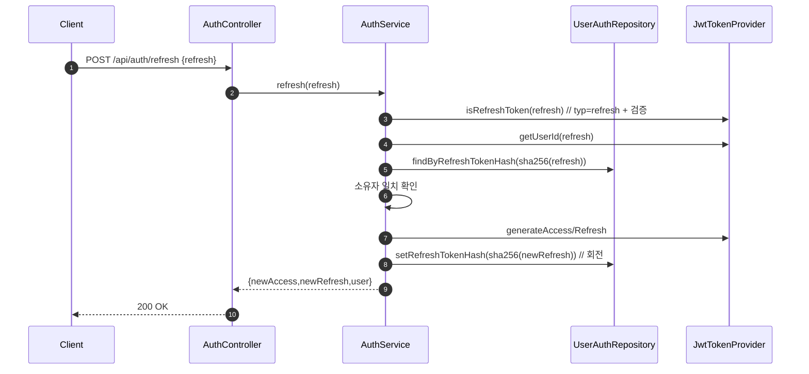
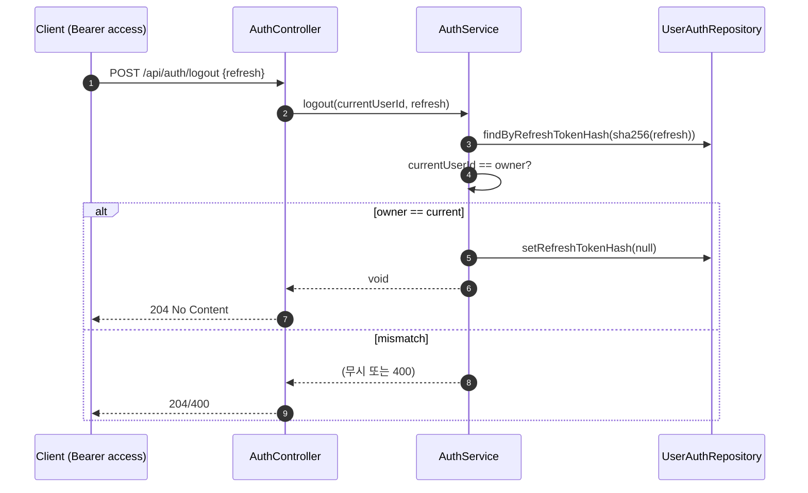

# SmartCane — User/Identity Domain (Signup / Login / Refresh / Logout / Profile)

본 문서는 **사용자 계정(프로필)과 인증(Access/Refresh JWT)** 전반의 흐름, API 요약, 시퀀스, 운영 팁을 담은 README입니다.

프로젝트 패키지 기준:
- 도메인: `com.smartcane.api.domain.identity`
- 시큐리티: `com.smartcane.api.security.*`

---

## 핵심 개념 요약

- **User**: 이메일/닉네임/생년월일/역할/상태 등 **프로필** 및 **권한**
- **UserAuth**: `provider`(LOCAL/APPLE/KAKAO/NAVER), **passwordHash(LOCAL)**, **refreshTokenHash** 등 **인증 자격**
- **JWT 분리**:
  - **Access**: 짧은 수명(기본 15분), API 인증에 사용
  - **Refresh**: 긴 수명(기본 30일), 재발급 전용 **(typ=refresh)**
- **Clock Skew 허용**: 서버/클라 시계 오차(기본 ±60초) 허용
- **Refresh 해시 저장**: DB에는 **리프레시 토큰 평문 저장 금지**, **SHA-256 해시만 저장**
- **회전(Rotation)**: 매 Refresh 시 기존 해시 → 새로운 해시로 **교체**

---

## 데이터 모델 (요약)

- `users`
  - `id`, `email(unique)`, `nickname`, `birthDate`, `role(USER|ADMIN)`, `status(ACTIVE|SUSPENDED|DELETED)`, `created_at`, `updated_at`
- `user_auth`
  - `id`, `user_id`, `provider(LOCAL|APPLE|KAKAO|NAVER)`, `password_hash(LOCAL)`, `refreshTokenHash`, `revokedAt`, `created_at`, `updated_at`

> 상세 스키마는 `db/migration/V1__init.sql`, `V2__add_birthdate_to_users.sql` 참고

---

## API 요약

### Auth
- `POST /api/auth/signup` — 회원가입 (User + UserAuth(LOCAL))
- `POST /api/auth/login` — 로그인(이메일/비밀번호) → **access**, **refresh** 발급
- `POST /api/auth/refresh` — **typ=refresh** 검증 후 새 토큰 쌍 발급(회전)
- `POST /api/auth/logout` — 현재 사용자 + 전달된 **refresh** 무효화(해시 제거)

### User
- `GET /api/identity/me` — 내 정보 조회(Access 필요)
- `PATCH /api/identity/me` — 내 프로필 수정(닉네임/생년월일)
- `GET /api/identity/users/{id}` — 단건 조회(ADMIN 전용)

> 공개 경로: `/api/auth/**`
> 인증 필요: 그 외 `/api/**` (SecurityConfig에서 정의)

---

## 시퀀스 다이어그램

### 1) 회원가입


### 2) 로그인


### 3) Access로 보호 API 호출


### 4) 리프레시 (회전)


### 5) 로그아웃


---

## 요청/응답 스펙 (요약)

### `POST /api/auth/signup`
- **Req**: `{ email, nickname, birthDate(yyyy-MM-dd), password }`
- **Res**: `UserResponse`
- **에러**: 409(이메일 중복), 400(검증 실패)

### `POST /api/auth/login`
- **Req**: `{ email, password }`
- **Res**: `{ accessToken, refreshToken, user }`
- **에러**: 401/400(자격 불일치)

### `POST /api/auth/refresh`
- **Req**: `{ refreshToken }`
- **Res**: `{ accessToken, refreshToken, user }` (회전)
- **에러**: 401/400(typ≠refresh, 만료, 소유자 불일치)

### `POST /api/auth/logout`
- **Req**: `{ refreshToken }` (헤더의 Access로 사용자 식별)
- **Res**: `204 No Content`

### `GET /api/identity/me`
- **Req**: `Authorization: Bearer {access}`
- **Res**: `UserResponse`

### `PATCH /api/identity/me`
- **Req**: `{ nickname?, birthDate? }`
- **Res**: `UserResponse`

---

## cURL 예시

```bash
# 1) 회원가입
curl -sS -X POST http://localhost:8081/api/auth/signup \
  -H 'Content-Type: application/json' \
  -d '{
    "email":"neo@smartcane.com",
    "nickname":"Neo",
    "birthDate":"1990-05-20",
    "password":"Passw0rd!"
  }'

# 2) 로그인
curl -sS -X POST http://localhost:8081/api/auth/login \
  -H 'Content-Type: application/json' \
  -d '{"email":"neo@smartcane.com","password":"Passw0rd!"}'

# 결과에서 access/refresh 추출 후 환경변수에 저장
ACCESS=eyJ...; REFRESH=eyJ...

# 3) 내 정보
curl -sS http://localhost:8081/api/identity/me \
  -H "Authorization: Bearer $ACCESS"

# 4) 프로필 수정
curl -sS -X PATCH http://localhost:8081/api/identity/me \
  -H 'Content-Type: application/json' \
  -H "Authorization: Bearer $ACCESS" \
  -d '{"nickname":"Neo2"}'

# 5) 토큰 재발급(회전)
curl -sS -X POST http://localhost:8081/api/auth/refresh \
  -H 'Content-Type: application/json' \
  -d "{\"refreshToken\":\"$REFRESH\"}"

# 6) 로그아웃
curl -sS -X POST http://localhost:8081/api/auth/logout \
  -H 'Content-Type: application/json' \
  -H "Authorization: Bearer $ACCESS" \
  -d "{\"refreshToken\":\"$REFRESH\"}"
```

---

## 보안/운영 체크리스트

- [ ] **JWT 시크릿**: 운영에선 환경변수/Secret Manager 사용(32바이트 이상, Base64 권장)
- [ ] **Clock skew**: `smartcane.jwt.clock-skew-seconds`(기본 60초)
- [ ] **Access/Refresh 분리**: `typ=access|refresh` 구분, 필터는 access만 허용
- [ ] **Refresh 해시 저장**: 평문 저장 금지, `SecureHashUtil.sha256Hex` 사용
- [ ] **회전(Rotation)**: refresh 성공 시 반드시 해시 교체
- [ ] **로그아웃**: 현재 사용자와 refresh 소유자 일치 시 해시 제거
- [ ] **CORS/HTTPS**: 운영환경 HTTPS 강제, 허용 Origin 제한
- [ ] **비밀번호 해시**: `BCryptPasswordEncoder` 사용(절대 평문 저장 금지)
- [ ] **권한**: ADMIN 경로에 `@PreAuthorize("hasRole('ADMIN')")`
- [ ] **감사로그(선택)**: 로그인 실패/중요 변경 이벤트 감사 로깅

---

## 문제 해결(FAQ)

- **로그인은 되었는데 보호 API가 401**
  - Authorization 헤더 `Bearer {access}` 확인
  - Access 만료/서명오류 → 재로그인 또는 `/refresh`
  - 서버 시간 확인(NTP 동기화)

- **`/refresh`가 400/401**
  - 전달 토큰이 **typ=refresh**인지 확인
  - 만료/회수됨 → 재로그인 필요
  - DB의 `user_auth.refreshTokenHash`와 해시가 일치하는지 확인

- **로그아웃했는데 계속 호출됨**
  - 클라이언트가 캐시된 access를 계속 쓰는 중 → access 만료 대기 또는 강제 폐기 처리 필요

---

## Swagger 설정 팁

- `OpenApiConfig`에서 Bearer 스키마 등록 → Swagger UI에서 **Authorize** 버튼으로 access 입력 후 테스트
- 운영에서 Swagger 공개 여부 판단(기본 보안 설정 필요)

---

## 버전 이력

- v1.0: 초기 작성 (JWT 시큐리티, 회전, 해시 저장 정책 반영)

