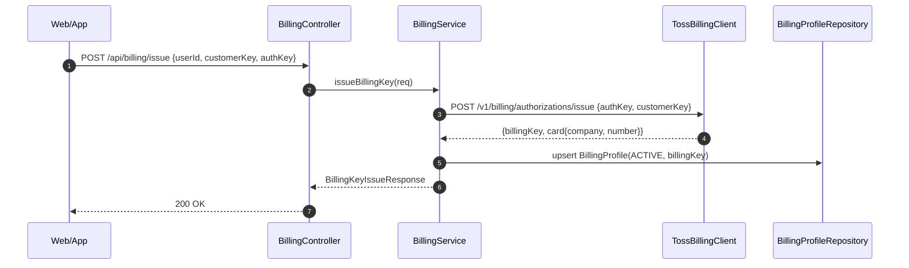
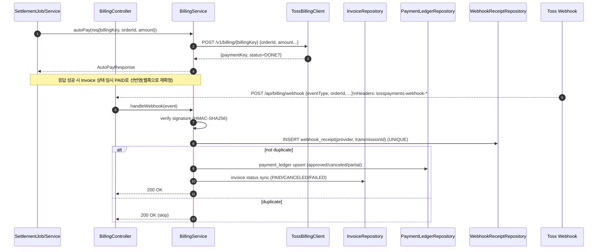
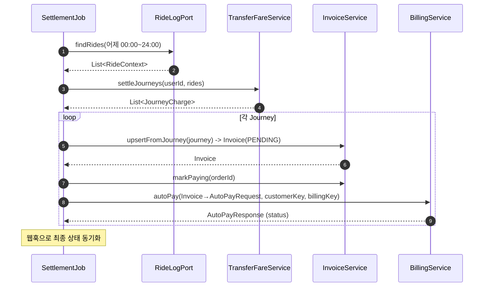
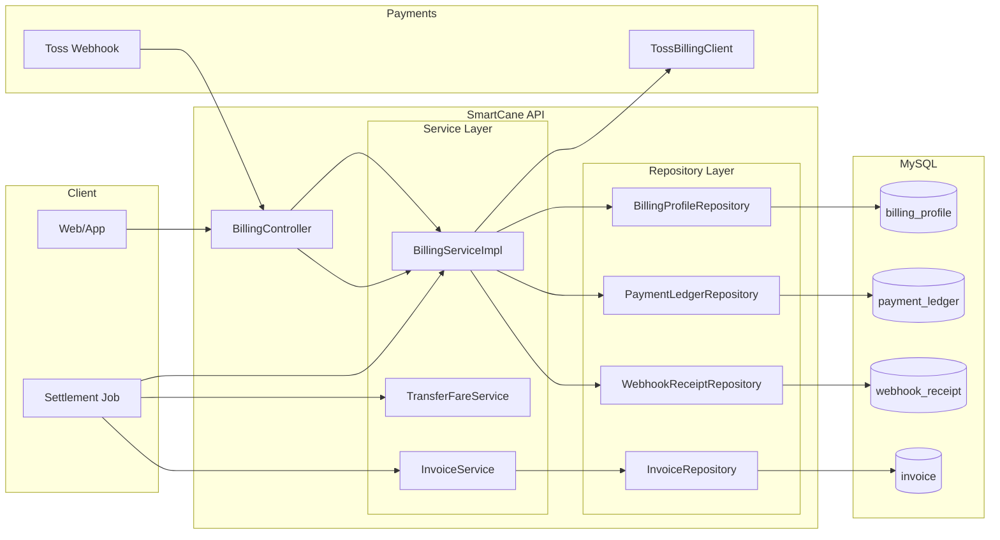

# SmartCane — Billing Domain (Auto-Pay / Webhook / Ledger / Invoice / Settlement)

본 문서는 **빌링키 발급 → 자동결제 → 취소 → 웹훅 수신/검증 → 원장(Ledger) 반영 → 인보이스(청구) 생성 → 정산 배치(일괄 청구)** 의 흐름과 API, 데이터 모델, 운영 팁을 담은 **README**입니다.  
프로젝트 패키지 기준: `com.smartcane.api.domain.billing` (+ 정산/운임 계산 `fare`, `settlement` 서브 패키지)

---

## 핵심 질문: “자동결제, 웹훅?”

- **자동결제 실행**: 우리 서버가 **토스 API**에 `billingKey`로 **직접 승인 요청**(서버→토스).
- **웹훅(Webhook)**: 토스가 결제 상태 변경을 우리 서버 **URL**로 알려주는 **HTTP POST 콜백**(토스→서버).
    - 자동결제를 “웹훅이 실행”하는 게 아니라, **우리 호출이 주체**이고 웹훅은 **사후 확정/동기화**입니다.

---

## 엔드포인트 요약

### Billing (Controller: `/api/billing/*`)
- `POST /api/billing/issue` — 빌링키 발급(사용자 카드 인증 후 `authKey`로 교환)
- `POST /api/billing/pay` — 빌링키 자동결제(멱등 키 = `orderId`)
- `POST /api/billing/cancel` — 결제 취소(사유/금액 지정 가능)
- `POST /api/billing/webhook` — 웹훅 수신 (토스→서버, HMAC 검증)

### Invoice (청구)
- 내부 사용(배치/백오피스): `InvoiceService`를 통해 **JourneyCharge → Invoice 저장 → autoPay**

---

## 시퀀스 다이어그램

### 1) 빌링키 발급(한 번만)

### 2) 자동결제 & 웹훅 동기화




### 3) 정산 배치(하루치 묶음 → 인보이스 생성 → 자동결제)


### 컴포넌트/데이터 모델


## 데이터 테이블(Flyway 요약)

- `payment_ledger` — 결제/환불 원장 (승인/부분취소/전액취소 상태 저장)
- `webhook_receipt` — **웹훅 중복 차단**을 위한 수신 기록 (UNIQUE(provider, transmission_id))
- `invoice` — 여정 단위 청구서 (멱등 키 = `order_id`)
- `billing_profile` — 사용자↔PG 고객키/빌링키 상태 (ACTIVE/REVOKED…)

---

## 보안/권한

- **시큐리티 권장**
    - `POST /api/billing/webhook` → `permitAll` (코드에서 HMAC 검증 + Nginx 소스 IP 제한)
    - `POST /api/billing/issue` → `ROLE_USER|ADMIN`
    - `POST /api/billing/pay` → `ROLE_SYSTEM|ADMIN` *(또는 내부 배치만 호출)*
    - `POST /api/billing/cancel` → `ROLE_ADMIN|CS|SYSTEM`

- **웹훅 헤더(토스)**
    - `tosspayments-webhook-transmission-time`
    - `tosspayments-webhook-transmission-id`
    - `tosspayments-webhook-transmission-retried-count`
    - `tosspayments-webhook-signature`

- **서명 검증(HMAC-SHA256)**
    - 메시지: `rawBody + ":" + transmissionTime`
    - 헤더의 `v1:Base64` 값 중 하나와 일치하면 유효

---

## 운임/청구(우리 정책)

- **운임 계산기(FareCalculator)**:
    - 버스 **1,400원**, 지하철 **1,550원** (정액)
    - (옵션) 교통약자/구독 할인

- **환승/통합요금(TransferFareService)**:
    - 환승 창구(기본 **30분**) 내 추가 탑승 → **FREE/FLAT/RATIO** 정책으로 보정
    - 여정 단위로 `orderId` 생성 → **Invoice 저장 → autoPay 호출**

---

## cURL 예시

```bash
# 1) 빌링키 발급
curl -sS -X POST http://localhost:8081/api/billing/issue \
  -H 'Content-Type: application/json' \
  -d '{
    "userId": 1001,
    "customerKey": "cust_1001",
    "authKeyOrToken": "AUTH-KEY-FROM-FRONT"
  }'

# 2) 자동결제(배치/관리성 호출)
curl -sS -X POST http://localhost:8081/api/billing/pay \
  -H 'Content-Type: application/json' \
  -d '{
    "userId": 1001,
    "customerKey": "cust_1001",
    "billingKey": "bill_live_abc...",
    "orderId": "JNY-1001-1726537800-1726540800",
    "orderName": "교통요금(2025-09-17 08:10~09:20)",
    "amount": 1550,
    "currency": "KRW"
  }'

# 3) 결제 취소(부분/전액)
curl -sS -X POST http://localhost:8081/api/billing/cancel \
  -H 'Content-Type: application/json' \
  -d '{
    "userId": 1001,
    "paymentKey": "pay_live_xyz",
    "cancelReason": "사용자 요청"
  }'

# 4) 웹훅 수신(토스→서버; 테스트용 로컬 POST)
curl -sS -X POST http://localhost:8081/api/billing/webhook \
  -H 'Content-Type: application/json' \
  -H 'tosspayments-webhook-transmission-time: 2025-09-17T11:20:01Z' \
  -H 'tosspayments-webhook-transmission-id: abc-123' \
  -d '{
    "eventType": "payment.approved",
    "paymentKey": "pay_live_xyz",
    "orderId": "JNY-1001-1726537800-1726540800",
    "status": "DONE",
    "approvedAt": "2025-09-17T11:20:00+09:00"
  }'


```

## 운영 팁 & 체크리스트

- **멱등성**: `orderId` UNIQUE(Invoice, Ledger)로 중복 승인 방지
- **웹훅 중복**: `webhook_receipt`에 `UNIQUE(provider, transmission_id)`로 차단
- **서명 검증**: 서명 헤더가 있는 유형은 HMAC 검증 필수, 없는 유형은 **소스 IP 제한**
- **모니터링**: 승인/실패/취소율, 웹훅 실패/중복 카운트 지표화
- **권한 경계**: `/pay`는 SYSTEM 전용으로 좁혀 운영
- **로그 마스킹**: 카드번호/개인정보 필드 마스킹
- **재시도 전략**: `FAILED` 인보이스만 대상으로 재시도 배치 운용
- **정산 보고**: Ledger/Invoice 기준으로 기간별 리포트(일/주/월) 생성

---

## 설정 스니펫 (application.yml)

```yaml
billing:
  api-base-url: https://api.tosspayments.com
  secret-key: ${TOSS_SECRET_KEY}
  webhook:
    secret: ${TOSS_WEBHOOK_SECRET}

smartcane:
  fare:
    currency: KRW
    bus-fare: 1400
    subway-fare: 1550
    discounts:
      accessible-user-rate: 0.5
      subscription-rate: 0.0
    transfer:
      enabled: true
      window-minutes: 30
      max-transfers: 4
      pricing:
        type: FREE   # FREE | FLAT | RATIO
        flat-amount: 0
        ratio: 0.0
```

## 관련 클래스(요약)

- `config/BillingConfig`, `TossBillingClient` — 토스 API WebClient 설정/호출
- `controller/BillingController` — `/api/billing/*`
- `service/BillingServiceImpl` — 자동결제/취소/웹훅 처리(서명 검증, 중복 차단, Ledger/Invoice 동기화)
- `entity` — `BillingProfile`, `PaymentLedger`, `WebhookReceipt`, `Invoice`
- `repository` — 각 엔티티 리포지토리
- `fare` — `FareCalculator`, `TransferFareService`
- `settlement` — `RideLogPort`, `SettlementJob` (스케줄러)

---

## 용어

- **BillingKey**: 사용자 카드에 대한 자동결제용 토큰
- **CustomerKey**: 우리 시스템의 사용자↔PG 매핑 키
- **OrderId**: 결제 멱등 키(여정 단위로 생성)
- **Ledger**: 결제/환불 상태의 단일 진실원장(회계/분쟁 근거)
- **Invoice**: 청구 레코드(금액/기간/결제 상태)
