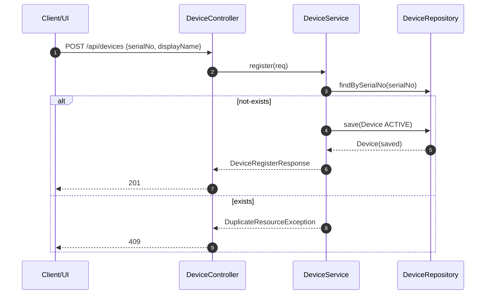
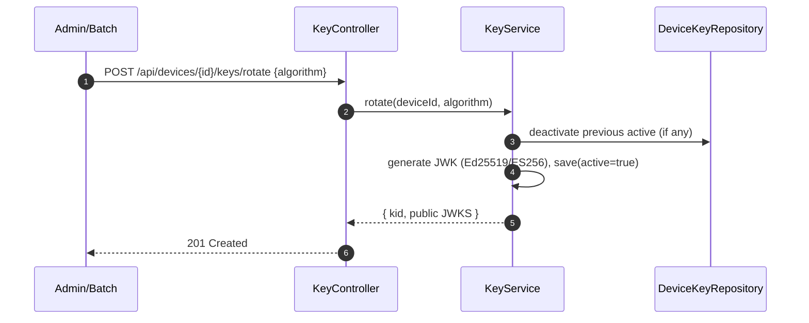
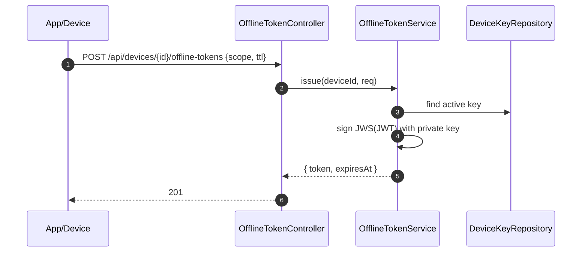
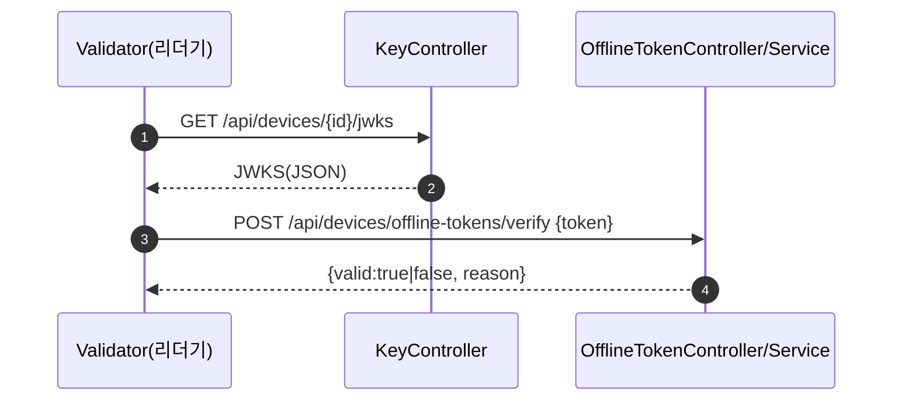

# SmartCane — Device Domain (Register / Bind / Key / Offline Token)

본 문서는 **디바이스 등록 → 사용자-디바이스 바인딩 → 키 로테이션/JWKS → 오프라인 토큰 발급·검증·폐기**의 전체 흐름과 API 요약, 운영 팁을 담은 **README**입니다.  
프로젝트 패키지 기준: `com.smartcane.api.domain.device` / 보안 유틸: `com.smartcane.api.security.util`

---

## 핵심 질문: “디바이스 등록을 통해 암호화하고 그러는건가?”

- **아니요. ‘등록’ 자체는 암호화 동작을 포함하지 않습니다.**
- 흐름은 아래와 같습니다.
  1) **디바이스 등록**: `serialNo`를 유니크로 DB 저장 (상태 기본 ACTIVE)  
  2) **키 로테이션(생성)**: 디바이스용 **서명키 쌍(JWK)** 생성 → **개인키는 AES-GCM/KMS로 암호화 저장** → **공개키는 JWKS로 조회 가능**  
  3) **오프라인 토큰 발급**: 활성 개인키로 **JWT(JWS)** 서명 → 클라이언트/디바이스가 보관 → 검증기는 JWKS로 검증  
  4) **검증·폐기**: JWKS로 서명 검증, DB의 `offline_token.revoked`, `exp` 확인

즉, **암호화/서명 관련 행위는 ‘키 로테이션/토큰 발급’ 단계에서 수행**되며, 등록은 그 전제 조건입니다.

---

## API 요약

### Device
- `POST /api/devices` — 디바이스 등록
- `GET /api/devices/{id}` — 단건 조회

### Device Binding
- `POST /api/devices/{deviceId}/bind` — 사용자-디바이스 바인딩(기기당 active 1개 유지)
- `POST /api/devices/{deviceId}/unbind` — 바인딩 해지
- `GET /api/devices/{deviceId}/binding` — 기기 active 바인딩 조회
- `GET /api/users/{userId}/device-bindings?active=true|false` — 사용자별 바인딩 목록

### Key / JWKS
- `POST /api/devices/{deviceId}/keys/rotate` — 키 로테이션(활성 키 생성)
- `GET  /api/devices/{deviceId}/jwks` — 활성 공개키 JWKS(JSON)
- `POST /api/devices/{deviceId}/keys/{kid}/deactivate` — 특정 키 비활성화

### Offline Token
- `POST /api/devices/{deviceId}/offline-tokens` — 토큰 발급 (scope, ttlSeconds)
- `POST /api/devices/offline-tokens/verify` — 토큰 검증
- `POST /api/devices/{deviceId}/offline-tokens/revoke` — 토큰 폐기(블랙리스트)

---

## 시퀀스 다이어그램









---

## 컴포넌트/데이터 모델

```mermaid
flowchart LR
  subgraph Client
    App[모바일/관리 UI]
    Validator[차량 단말(리더기)]
  end

  subgraph API[SmartCane API]
    DC[DeviceController]
    DBC[DeviceBindingController]
    KC[KeyController]
    OTC[OfflineTokenController]

    subgraph Svc[Service Layer]
      DS[DeviceService]
      DBS[DeviceBindingService]
      KS[KeyService]
      OTS[OfflineTokenService]
    end

    subgraph Repo[Repository Layer]
      DR[DeviceRepository]
      DBR[DeviceBindingRepository]
      DKR[DeviceKeyRepository]
      OTR[OfflineTokenRepository]
    end
  end

  subgraph Sec[Security Utils]
    KU[KeyUtil (JWK/JWKS)]
    AU[AuthUtil]
    SH[SecureHashUtil]
  end

  subgraph DB[Database]
    T1[device]
    T2[device_binding]
    T3[device_key]
    T4[offline_token]
  end

  App -->|REST| DC --> DS --> DR --> T1
  App -->|REST| DBC --> DBS --> DBR --> T2
  App -->|REST| KC --> KS --> DKR --> T3
  App -->|REST| OTC --> OTS --> OTR --> T4
  KS --> KU
  OTS --> KU
  Validator -->|/api/devices/{id}/jwks| KC

```

---

## 운영 팁 & 보안 권장

- **개인키 보호**: `DeviceKey.jwkPrivateJson`은 **AES-GCM + KMS/SecretManager**로 암호화 저장  
- **키 정책**: 기기당 **active key = 1개** 유지, 로테이션 시 이전 키 비활성화  
- **JWKS 캐싱**: 검증기(Validator)에서 JWKS를 **TTL 캐시** 후 사용, 키 교체 주기에 맞춰 갱신  
- **시간 동기화**: JWT 만료 정확성 확보를 위해 서버/단말 NTP 동기화  
- **토큰 관리**: 만료/폐기된 토큰 정리 배치, `offline_token.expires_at` 인덱스 유지

---

## cURL 예시

```bash
# 1) 디바이스 등록
curl -sS -X POST http://localhost:8080/api/devices \
  -H 'Content-Type: application/json' \
  -d '{ "serialNo": "SC-001", "displayName": "SmartCane #1" }'

# 2) 키 로테이션
curl -sS -X POST http://localhost:8080/api/devices/{DEVICE_ID}/keys/rotate \
  -H 'Content-Type: application/json' \
  -d '{ "algorithm": "ED25519" }'

# 3) JWKS 조회
curl -sS http://localhost:8080/api/devices/{DEVICE_ID}/jwks

# 4) 오프라인 토큰 발급
curl -sS -X POST http://localhost:8080/api/devices/{DEVICE_ID}/offline-tokens \
  -H 'Content-Type: application/json' \
  -d '{ "scope": "FARE_TAP", "ttlSeconds": 86400 }'

# 5) 오프라인 토큰 검증
curl -sS -X POST http://localhost:8080/api/devices/offline-tokens/verify \
  -H 'Content-Type: application/json' \
  -d '{ "token": "eyJhbGciOiJFZERTQSIsImtpZCI6Ii4uLiJ9..." }'
```

---

## 체크리스트

- [ ] `Device` 엔티티에 `@Builder` 포함 여부 확인  
- [ ] `KeyUtil` 패키지: `com.smartcane.api.security.util` 로 통일  
- [ ] `KeyService.getActiveJwks()`는 `JSONObjectUtils.toJSONString(map)` 사용  
- [ ] 컨트롤러 `GET /jwks`는 `produces = application/json` 지정 권장  
- [ ] `CryptoUtil(AES-GCM)` 도입 시 개인키 저장/복호화 경로 점검